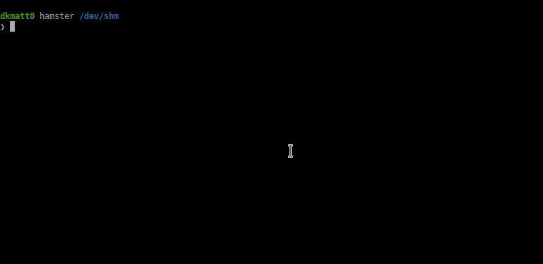
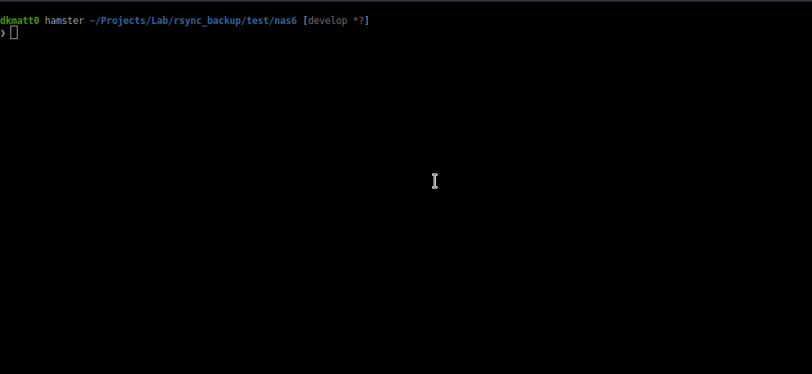

# Rsync backup

## save.py

Ce script permet la sauvegarde journalière simultanée de plusieurs machines en utilisant rsync (via une connexion ssh) vers la machine locale. Il est parfait pour être placer dans un cron.

### Prérequis

Rsync et ssh doivent être installés sur la machine locale ainsi que sur les machines distantes. Les machines distantes devront être accessibles via une connexion automatique par clé ssh.

### Installation

L'installation n'étant possible que manuellement, voici un exemple avec git :

```bash
git clone https://github.com/dkmatt0/rsync_backup.git /tmp/rsync_backup
sudo cp /tmp/rsync_backup/save.py /usr/local/bin/save
sudo chmod +x /usr/local/bin/save
rm -rf /tmp/rsync_backup/
```

Et voici un exemple avec zip :

```bash
wget https://github.com/dkmatt0/rsync_backup/archive/master.zip -O /tmp/rsync_backup.zip
unzip /tmp/rsync_backup.zip -d /tmp/
sudo cp /tmp/rsync_backup-master/save.py /usr/local/bin/save
sudo chmod +x /usr/local/bin/save
rm -rf /tmp/rsync_backup.zip /tmp/rsync_backup-master/
```

Après cela, le script pourra être lancé par la commande `save`.

### Utilisation



Pour sauvegarder des machines avec ce script, il est nécessaire de fournir une liste de machines avec l'argument `--server-file` (ou la version courte `-s`). Cette liste est un simple fichier texte contenant un nom dns ou ip par ligne.

Exemple:

```text
machine1
machine2.local
10.0.0.34
```

Par défaut, 2 machines sont sauvegardées en simultanées. La sauvegarde ce fait dans des sous-dossiers du dossier courant. Ces sous-dossiers porte le nom de la machines tel qu'il est mis dans la liste évoquée précédemment.

Exemple d'arborescence :

```text
dossier courant
|
|-- machine1
|  |-- current
|  |-- 20201126
|  |-- 20201127
|
|-- machine2.local
|  |-- current
|  |-- 20201126
|  |-- 20201127
|
|-- 10.0.0.34
|  |-- current
|  |-- 20201126
|  |-- 20201127

```

Nous avons donc la sauvegarde qui est fait dans `<dossier courant>/<nom de la machine>/current`. Quand la sauvegarde se termine correctement, le dossier `current` est copié (avec un hadlink) dans un dossier portant la date du jour.

### Options

| Option | Options courte | Description |
|--------|----------------|-------------|
| `--backupdir` | `-b` | Spécifie le dossier contenant les sauvegardes (par défaut, il s'agit du dossier courant). |
| `--remotedir` | `-r` | Spécifie le dossier à sauvegarder sur les machines distances. |
| `--server-file` | `-s` | Spécifie le fichier avec les machines à sauvegarder |
| `--max` | `-m` | Nombre de sauvegardes en simultanées |
| `--ssh-user` | `-u` | Utilisateur ssh à utiliser pour la connexion rsync |
| `--ssh-args` | `-A` | Arguments ssh à utiliser pour la connexion rsync |
| `--rsync-args` | `-a` | Arguments rsync à utiliser pour la connexion |
| `--quiet` | `-q` | Rendre le script moins bavarre (n'affiche que les erreurs critiques). |
| `--verbose` | `-v` | Rendre le script plus bavarre. Compatible avec l'option `quiet`. |
| `--dry-run` | `-n` | Lance le script en mode simulation. |

### Information supplémentaire

Pour les plus curieux d'entre vous voici le déroulement du programme :

 * Définition des import, variables et arguments du programme ainsi que divers vérifications de droits
 * Stockage de la liste des serveurs dans une variable et on lance une boucle :
   * Sélection d'un nombre N de serveurs (définie par défaut ou dans les arguments)
   * Sur chacun des serveurs sélectionnés :
     * On test si le ping est Ok
     * On lance un rsync vers le dossier "current"
     * On copie current (en mode hardlink) vers un dossier ayant pour nom la date du jour
 * On affiche l'état de chaque serveurs

## rotate.py

Rotate.py permet de conserver une sauvegarde par période pendant X périodes. Ces périodes sont les jours, semaines, mois et années.

Exemple : vous souhaitez conserver les 10 dernières sauvegardes journalier, ainsi que le 5 derniers sauvegarde hebdomadaire et les 3 derniers sauvegarde mensuelle ? Avec ce script, c'est possible.

Par défaut, est conservé les 7 derniers jours, les 5 dernières semaines, les 3 derniers mois et les 2 dernières années. Nous avons donc 16 sauvegardes. C'est toujours la première sauvegarde de chaque période qui est conservé.

Il faut prendre en compte que les périodes ne sont pas liées à des dates fixes. Par exemple, quand on choisi de conservé les 7 derniers jours, il faut comprendre qu'on conserve les 7 dernières sauvegardes ayant des jours différents. De même pour les semaines, mois et année.

### Prérequis

Il est nécessaire d'avoir python 3.7 d'installé. Les noms des dossiers de sauvegarde doivent avoir un format précis, c’est-à-dire AAAAMMJJ (A = année, sur 4 chiffres, M = mois, sur 2 chiffres et J = jour, sur 2 chiffres). Les dossiers avec un nom ne respectant pas ce format seront ignorés.

Ce script n'a été testé que sous linux mais il devrait pouvoir fonctionner sous windows et mac OSX. N’hésitez pas à remonter tout problème que vous pourriez rencontrer.

### Installation

L'installation n'étant possible que manuellement, voici un exemple avec git :

```bash
git clone https://github.com/dkmatt0/rsync_backup.git /tmp/rsync_backup
sudo cp /tmp/rsync_backup/rotate.py /usr/local/bin/rotate
sudo chmod +x /usr/local/bin/rotate
rm -rf /tmp/rsync_backup/
```

Et voici un exemple avec zip :

```bash
wget https://github.com/dkmatt0/rsync_backup/archive/master.zip -O /tmp/rsync_backup.zip
unzip /tmp/rsync_backup.zip -d /tmp/
sudo cp /tmp/rsync_backup-master/rotate.py /usr/local/bin/rotate
sudo chmod +x /usr/local/bin/rotate
rm -rf /tmp/rsync_backup.zip /tmp/rsync_backup-master/
```

Après cela, le script pourra être lancé par la commande `rotate` depuis n'importe quel dossier de la machine.

### Utilisation



Pour l'utiliser, il suffit de se rendre dans le dossier contenant les différents jours de sauvegarde et de lancer la commande `rotate` pour utiliser les réglages par défaut. Les réglages par défaut sont modifiable en éditant les variables présentent au début du script. Vous pouvez également modifier les valeurs ponctuellement directement depuis la ligne de commande en utilisant les options présentée dans la section *Options*.

**Important** : abusez de l'option `--dry-run` (ou la version courte `-n`) pour faire vos tests et éviter des suppressions non désiré.

### Options

| Option | Options courte | Description |
|--------|----------------|-------------|
| `--day`  | `-d` | Définie le nombre de sauvegarde journalière à conserver. |
| `--week` | `-w` | Définie le nombre de sauvegarde hebdomadaire à conserver. |
| `--month` | `-m` | Définie le nombre de sauvegarde hebdomadaire à conserver. |
| `--year` | `-y` | Définie le nombre de sauvegarde annuelle à conserver. |
| `--quiet` | `-q` | Rendre le script moins verbeux (n'affiche que les erreurs critiques). |
| `--verbose` | `-v` | Rendre le script plus verbeux. Compatible avec l'option `quiet`. |
| `--backupdir` | `-b` | Spécifie le dossier contenant les sauvegardes (par défaut, il s'agit du dossier courant). |
| `--dry-run` | `-n` | Lance le script en mode simulation. |

### Information supplémentaire

Pour les plus curieux d'entre vous, voici le déroulement du programme :

 * Définition des import, variables et arguments du programme ainsi que divers vérifications de droits
 * Définition des regex permettant de parser le nom des dossiers de sauvegardes
 * On boucle sur chaque dossier :
   * On parse le nom du dossier et on vérifie que c'est une date valide
   * On déclare quelques variables nécessaire au tri des dossiers
   * On lance un test pour savoir si la date en cours correspont à la première date d'une période et on met à jour les variables correspondantes si besoin
 * On continue le programme seulement si il y a au moins un dossier avec une date valide
 * On sélectionne les sauvegardes à conserver
 * On affiche le résultat et on supprime les sauvegardes qui doivent l'être

## Contribuez

N'hésitez pas à me soumettre vos idées / bug dans une nouvelle issues.

Si vous êtes développeur, vous pouvez également me soumettre vos pull request. Pour cela, connectez-vous à votre compte Github, cliquez sur "Fork" en haut à gauche de cette page, modifiez le code et créez une pull request.
